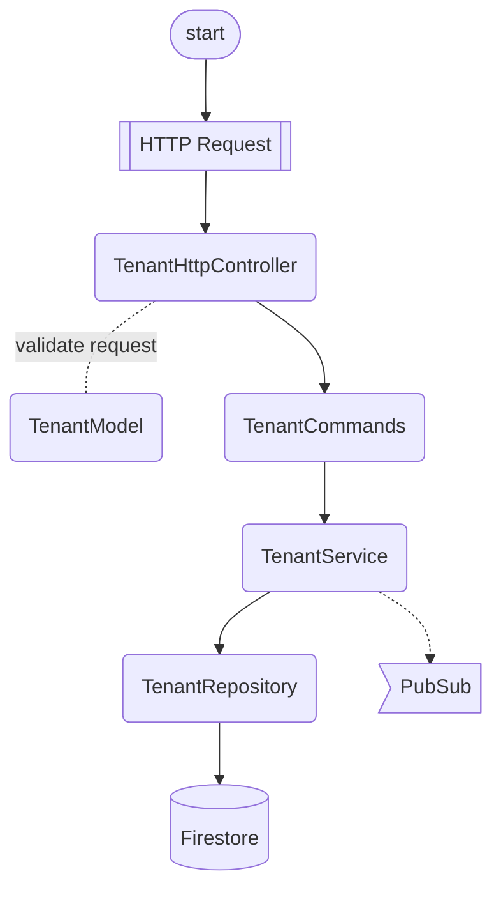

# Features

## Requests

### Overview

All HTTP request follow the same code flow but executing the appropriate methods for the associated endpoint.

The Controller is responsible for validating the parameters and body of the requests. The validation uses JSON Schema definitions found in the `db-json-schemas` repository (via GitHub Pages).

After the Service completes the request to the Repository, it publishes the event details to the `LogEventTopic` in PubSub.

_Typical HTTP request_

```http
GET /tenants/:id HTTP/1.1
```

_Typical code flow_



### Requests

#### Get Tenant

```http
GET /tenants/:id HTTP/1.1
```

#### Get Tenant Providers

```http
GET /tenants/:id/providers HTTP/1.1
```

#### Get Tenant Jobs

```http
GET /tenants/:id/jobs HTTP/1.1
```

#### Create Tenant

[Schema Reference](https://yunibas.github.io/json-schemas/tenant.json)

```http
POST /tenants HTTP/1.1
content-type: application/json

{}
```

#### Create Tenant Provider

[Schema Reference](https://yunibas.github.io/json-schemas/tenant_provider.json)

```http
POST /tenants/:id/providers HTTP/1.1
content-type: application/json

{}
```

#### Create Tenant Job

[Schema Reference](https://yunibas.github.io/json-schemas/tenant_job.json)

```http
POST /tenants/:id/jobs HTTP/1.1
content-type: application/json

{}
```
